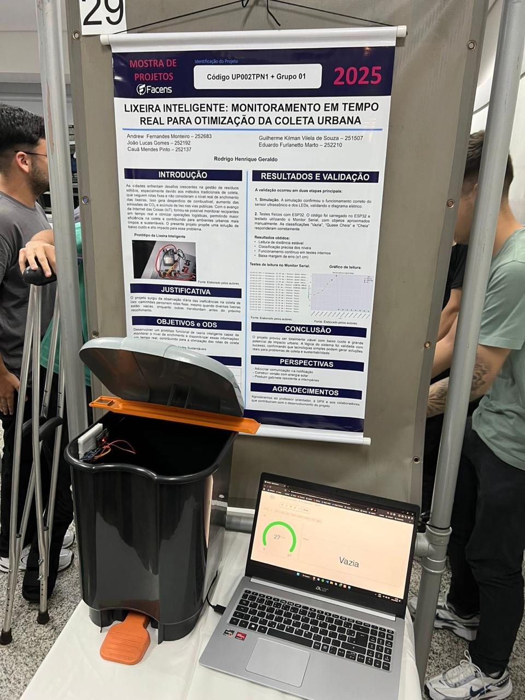
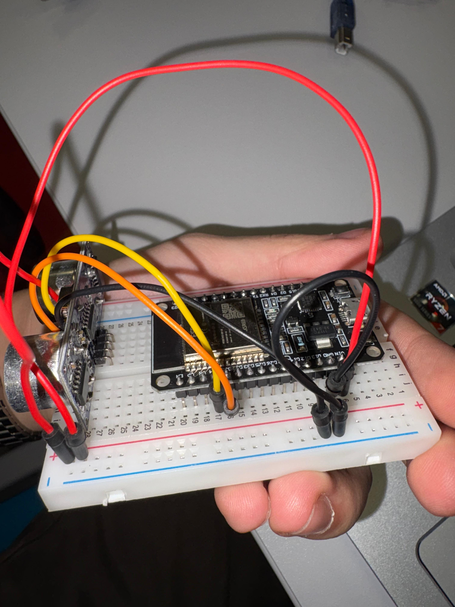
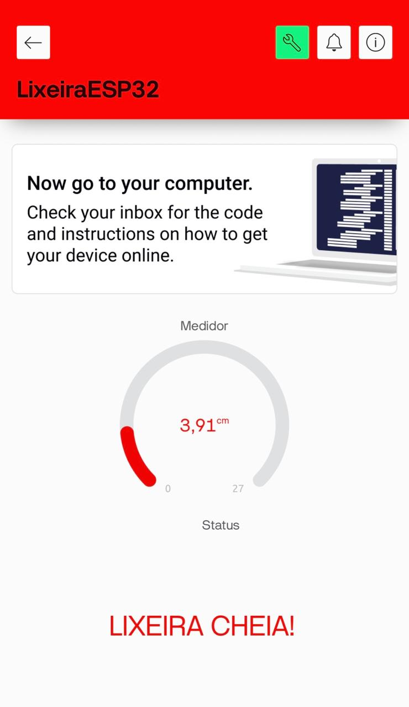
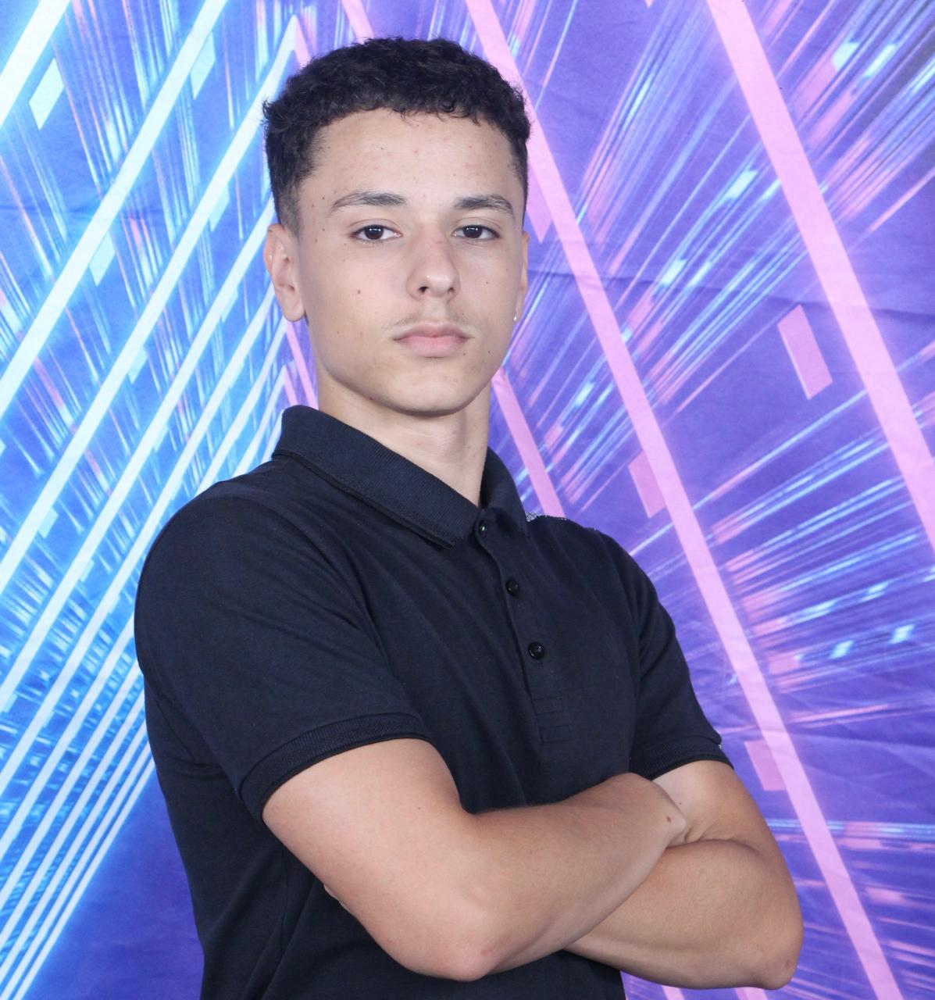

# 🗑️ Lixeira Inteligente - Smart Waste Management


> Um projeto de IoT focado em Cidades Inteligentes e Sustentabilidade, desenvolvido para a disciplina de UPx (Usina de Projetos Experimentais).

---

## 📸 O Projeto

<div align="center">

</div>

### 🎯 O Problema
A coleta de lixo urbana tradicional é ineficiente. Caminhões percorrem rotas fixas diariamente, gastando combustível e tempo para verificar lixeiras que muitas vezes estão vazias, enquanto outras transbordam, causando problemas sanitários e má experiência para a população.

### 💡 A Solução
Desenvolvemos um dispositivo de baixo custo capaz de monitorar o nível de preenchimento de lixeiras em tempo real. Os dados são enviados via Wi-Fi para um dashboard na nuvem, permitindo que gestores otimizem rotas de coleta.

---

## 🛠️ Hardware e Componentes

| Componente | Função |
| :--- | :--- |
| **ESP32 Dev Module** | Microcontrolador com Wi-Fi integrado (Cérebro) |
| **HC-SR04** | Sensor Ultrassônico (Medição de distância) |
| **Protoboard & Jumpers** | Conexões do circuito |
| **Fonte de Energia** | Alimentação via USB (5V) |

### 🔌 Esquema de Ligação (Pinout)

<div align="center">

</div>

| Sensor HC-SR04 | ESP32 |
| :--- | :--- |
| **VCC** | VIN (5V) |
| **GND** | GND |
| **Trig** | GPIO 26 (D26) |
| **Echo** | GPIO 25 (D25) |

---

## 📱 Dashboard e Software

O projeto utiliza a plataforma **Blynk** para visualização de dados.

**Funcionalidades do App:**
* 📶 **Medidor em Tempo Real:** Mostra o nível de lixo em cm.
* ⚠️ **Status Dinâmico:** Informa se está "Vazia", "Quase Cheia" ou "LIXEIRA CHEIA!".
* 📊 **Conectividade:** Indicador de status online/offline.

<div align="center">

</div>

---

## 🚀 Como Executar o Projeto

### Pré-requisitos
* Arduino IDE instalado.
* Biblioteca `Blynk` instalada na IDE.
* Drivers do ESP32 instalados.

### Instalação
1.  Clone este repositório:
    ```bash
    git clone [https://github.com/Joao-Lucas-Code/Upx2.git](https://github.com/Joao-Lucas-Code/Upx2.git)
    ```
2.  Abra o arquivo `.ino` na Arduino IDE.
3.  Instale a biblioteca **Blynk** pelo Gerenciador de Bibliotecas.
4.  Configure suas credenciais no código:
    ```cpp
    #define BLYNK_TEMPLATE_ID "SEU_ID"
    #define BLYNK_DEVICE_NAME "SEU_DEVICE"
    #define BLYNK_AUTH_TOKEN "SEU_TOKEN"
    char ssid[] = "SUA_REDE_WIFI";
    char pass[] = "SUA_SENHA";
    ```
5.  Conecte o ESP32 e faça o Upload.

---

## 👥 Autores

<table>
  <tr>
    <td align="center">
      <a href="https://www.linkedin.com/in/andrew-monteiro1313/">
        <br>
        <sub><b>Andrew Fernandes</b></sub>
      </a>
    </td>
    <td align="center">
      <a href="https://www.linkedin.com/in/cau%C3%A3-mendes-639ab7355/">
        <br>
        <sub><b>Cauã Mendes</b></sub>
      </a>
    </td>
    <td align="center">
      <a href="https://www.linkedin.com/in/eduardo-furlanetto/">
        <br>
        <sub><b>Eduardo Furlanetto</b></sub>
      </a>
    </td>
    <td align="center">
      <a href="https://www.linkedin.com/in/guilherme-klimam-villela-de-sousa-7a3784215/">
        <br>
        <sub><b>Guilherme Kliman</b></sub>
      </a>
    </td>
    <td align="center">
      <a href="https://www.linkedin.com/in/joaogomes6/">
        <br>
        <sub><b>João Lucas</b></sub>
      </a>
    </td>
  </tr>
</table>

**Orientador:** Prof. Dr. Rodrigo Henrique Geraldo

---

<p align="center">Desenvolvido com 💙 por alunos da Facens</p>
